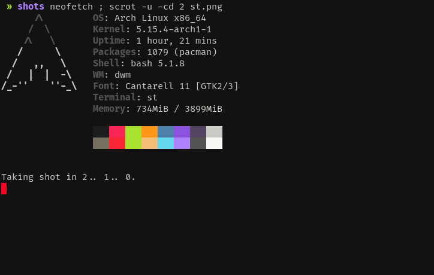

# de

Hos de

```c
#include <stdio.h>

int
main (void)
{
    printf("Test\n");
    return 0;
}
```

## Tools

- dmenu
- dwm
- farbfeld
- pterm
- st
- sterm
- sent
- slock
- slstatus
- tabbed

## Shots

### dmenu


### dwm


### pterm


### st



### sterm


### sent


### slstatus


